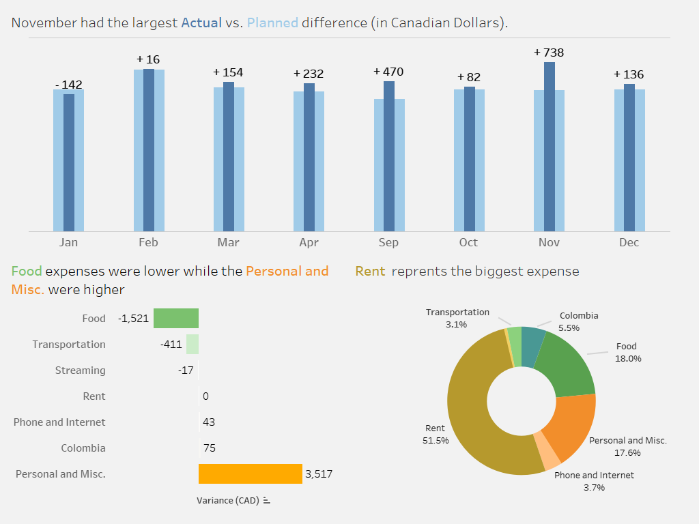
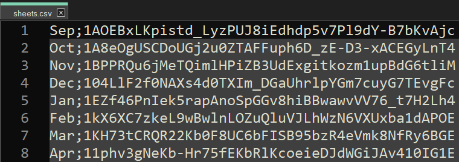
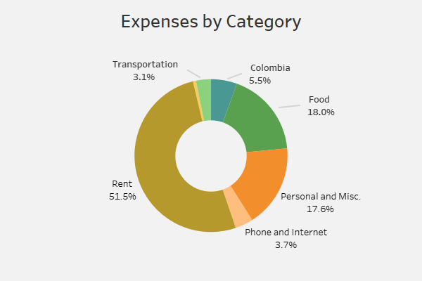
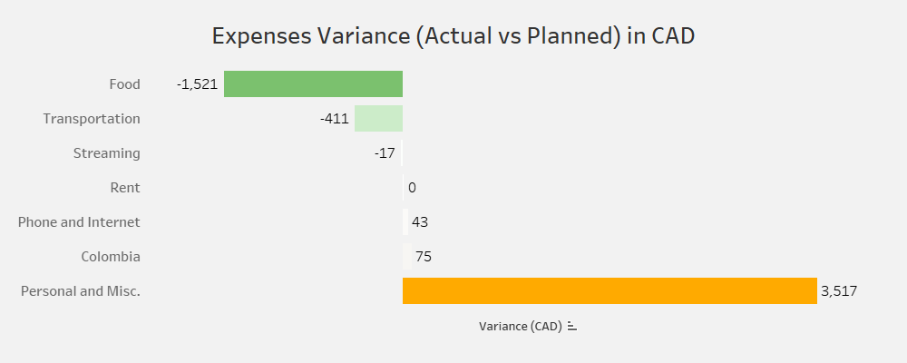
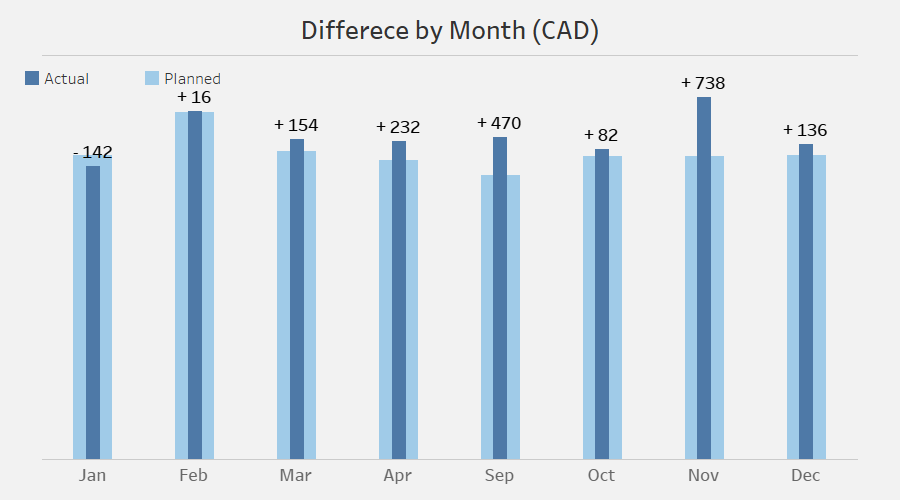

<a href="https://leopradilla.github.io/Portfolio/">Back to Portfolio</a>

# Budget Breakdown: Analyzing My Personal Budget

Since coming to Canada (and before that), I have been keeping a tight budget and tracking all my expenses. In the past, I tried different apps and methods, but the one that worked for me was the old, good, and reliable spreadsheets. I've been using Google Sheets as my expense tracker (Google even gives you a template you can use), and for the last 8 months, I have logged every single transaction meticulously. I believe I have gathered enough data to mine valuable insights from my spending habits.

| Goals                                 | Results                                                                                                 |
|---------------------------------------|---------------------------------------------------------------------------------------------------------|
|My primary objective for this project is to gain insights into my spending habits, optimize my expense allocation, and improve my financial awareness and planning. By meticulously tracking and analyzing my expenses, I aim to understand how my money is being spent, identify areas where I can potentially save or reallocate funds, and enhance my overall financial management skills. This objective will enable me to have better control over my personal budget, make informed financial decisions, and work towards long-term financial stability.|Approximately 52% of my total expenses are allocated to housing, particularly rent, underscoring its substantial influence on my overall financial situation. Food expenditure closely follows, accounting for roughly 18% of my total expenses. Notably, I have made significant savings in this category by reducing dining out, increasing home cooking, and implementing meal planning strategies. However, my personal and miscellaneous expenses have exceeded my planned budget by a significant margin, primarily due to unanticipated costs related to winter clothing. In order to avoid budget overruns, it is necessary to reassess this category and allocate additional funds accordingly.|

     

Link to dashboad in <a href="https://public.tableau.com/views/PersonalBudget_16863483847390/BudgetDashboard?:language=en-US&publish=yes&:display_count=n&:origin=viz_share_link">Tableau Public</a>

## Collecting the Data

Using the Google API to connect to Google services provides secure access to your information on Google Sheets. You need to set up the environment, enable the API, create credentials, install libraries, and a couple of other things. Fortunately, Google offers comprehensive documentation to achieve this using Python (or several other languages). The complete guide can be found <a href="https://developers.google.com/sheets/api/quickstart/python#configure_the_sample">here</a>.

To gather information from the spreadsheets, you will need the spreadsheet ID and the range of cells where the information is stored within the spreadsheet. In my case, I prefer to organize my budget on a monthly basis, so I have a separate sheet for each month of the year. Fortunately, I am using a template where the range of cells remains the same across all the spreadsheets. I created a simple CSV file with two columns: one for the name of the month and another for the corresponding spreadsheet ID.

     

    <em>Expenses by Category</em>

Note: One easy method to know the ID of your spreadsheet is to look for it in the URL of your spreadsheet. For example, for this spreadsheet: `https://docs.google.com/spreadsheets/d/1XVqFHuHWjps-aq2VremvHPVY2G9MpD24U9s1mV3H_qU/edit#gid=0` the ID is `1XVqFHuHWjps-aq2VremvHPVY2G9MpD24U9s1mV3H_qU`

## EDA

*Note: To ensure the privacy and security of my personal data, I have chosen not to disclose the precise values of my expenses in this project. Instead, I will introduce a deliberate amount of noise to the data as a means to obfuscate the actual values. By doing so, I aim to maintain the confidentiality of sensitive information while still enabling meaningful analysis. I believe this approach aligns with valid and understandable reasons for protecting personal data.*

Within the expenses, there are several one-time costs that occur sporadically, such as payments for college tuition and books. Additionally, there are occasional expenses, like those categorized under 'Furniture', which only appear in two months. While these categories still represent significant one-time expenses when they occur, they are infrequent and will be excluded from the analysis.

The 'Personal' and 'Other' categories group together expenses that are related to purchasing personal items, such as clothing, shoes, and personal care and hygiene products. These expenses may include items like toiletries, makeup, hair care products, and other personal care items. The 'Personal' category might also include expenses like haircuts or electronics, whereas the 'Other' category could include items like books or musical instruments. Although these categories share similarities in nature, they are separated to provide greater clarity when analyzing and categorizing expenses.

Additionally, I grouped similar categories together. For instance, I merged the categories "Internet" and "Cellphone" into a single category called "Phone and Internet". This consolidation approach was also applied to other relevant categories for improved organization and clarity in expense tracking.

The code can be found in this <a href="https://github.com/LeoPradilla/PersonalBudget/blob/main/files/budget_analysis_final.ipynb">jupyter notebook.</a>
  
  
## Visualizing the Data

     

    <em>Spreadsheet IDs</em>

Rent takes the largest share, accounting for approximately 52% of the total, emphasizing the significant impact of housing expenses on the overall budget. Food expenditure follows closely behind, representing around 18% of the total. Personal and miscellaneous expenses make up approximately 12.36% of the total. Phone and internet expenses occupy a smaller portion at around 3.73%, while transportation expenses represent approximately 3.83%. Other categories, including Colombia and streaming, have relatively smaller percentages, suggesting their minor contributions to the overall budget.

     

    <em>Expense Variance (CAD)</em>

In the period of eight months, Personal and Misc. expenses surpassed the planned budget by a significant margin of $3517, this can easily explain by the fact we did not budget for Winter clothing (shoes and winter jackets are expensive), besides that we needed to buy normal clothing and shoes. This category requires a reevaluation, and it is evident that a higher allocation of funds is necessary.

On a positive note, "Food", which includes dining out, presented the most substantial savings, which could be attributed to reduced eating out, increased home cooking, and meal planning.

     

    <em>Montlh Variance (CAD)</em>

November marked a significant gap between the planned and actual expenses, particularly the largest difference observed. Coming from a tropical country, we were unprepared for the winter, lacking the necessary clothing and experience in selecting appropriate items. Similarly, September presented the second-largest difference in expenses. This can be attributed to the fact that it was our inaugural month living in Canada, where we encountered various unexpected costs associated with settling into a new country and adapting to a different lifestyle.

In contrast, January emerged as the only month that showcased savings in our expenses. This favorable outcome was primarily due to the winter break period, which allowed us to reduce our expenditure. The break provided an opportunity to spend more time at home, thus reducing expenses associated with transportation, dining out, and entertainment.

## Conclusions

Based on this analysis, I have drawn several conclusions:
- Housing expenses, specifically rent, constitute the largest portion of my budget, accounting for approximately 52% of my total expenses. This emphasizes the significant impact of housing costs on my overall financial situation.
- Food expenditure follows closely behind, representing around 18% of my total expenses. It is worth noting that I have achieved significant savings in this category, likely due to reducing eating out, increasing home cooking, and implementing meal planning strategies.
- Personal and miscellaneous expenses have surpassed my planned budget by a significant margin. This can be attributed to unforeseen costs associated with winter clothing, as I had not adequately budgeted for the expenses related to adapting to a colder climate. Reevaluating this category and allocating more funds is necessary to avoid budget overruns.
- Certain months, such as November and September, exhibited notable differences between the planned and actual expenses. These discrepancies can be attributed to various factors, including unpreparedness for winter-related costs and settling into a new country with associated unexpected expenses. Understanding these variations helps me anticipate and plan for similar situations in the future.
- January emerged as the only month in which I achieved savings in my expenses. This favorable outcome can be attributed to the winter break period, which allowed me to reduce transportation, dining out, and entertainment expenses. Identifying such opportunities for savings and planning accordingly can help me maintain a more balanced budget throughout the year.

<a href="https://leopradilla.github.io/Portfolio/">Back to Portfolio</a>
